# Benchmark of `typescript-json`
> CPU: Apple M1 Pro
> Memory: 16,384 MB
> NodeJS version: v16.13.2

## assert
 Components | typescript-json | typescript-is 
------------|-----------------|---------------
object (hierarchical) | 25150.35154137372 | 24609.35819290068
object (recursive) | 29718.39488636364 | 22390.347633136094
object (union) | 5103.075489282385 | 2168.7317784256556
array (recursive) | 1334.4607290492295 | 1414.7048170952553
array (union) | 3045.815295815296 | 220.28035681776805
ultimate union | 4348.802673101913 | 31.990102509720746

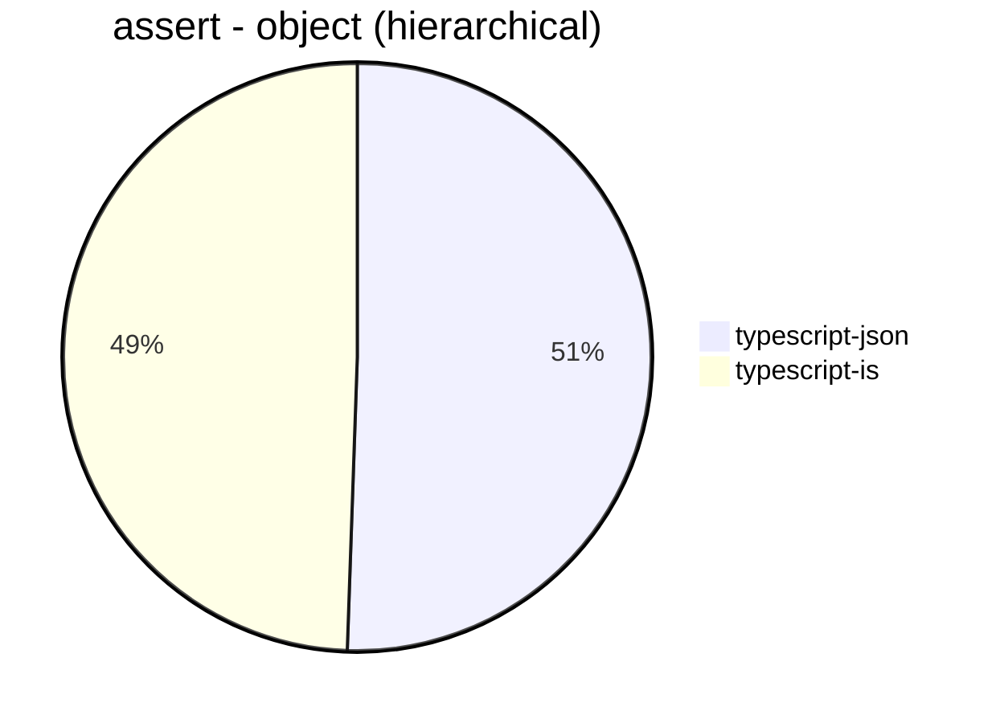
```mermaid
pie title assert - object (hierarchical)
  "typescript-json": 25150.35154137372
  "typescript-is": 24609.35819290068
```

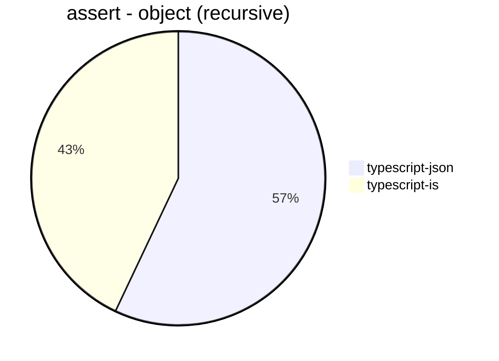
```mermaid
pie title assert - object (recursive)
  "typescript-json": 29718.39488636364
  "typescript-is": 22390.347633136094
```

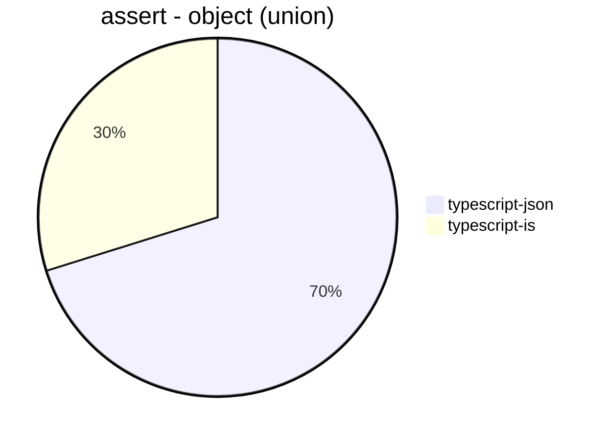
```mermaid
pie title assert - object (union)
  "typescript-json": 5103.075489282385
  "typescript-is": 2168.7317784256556
```

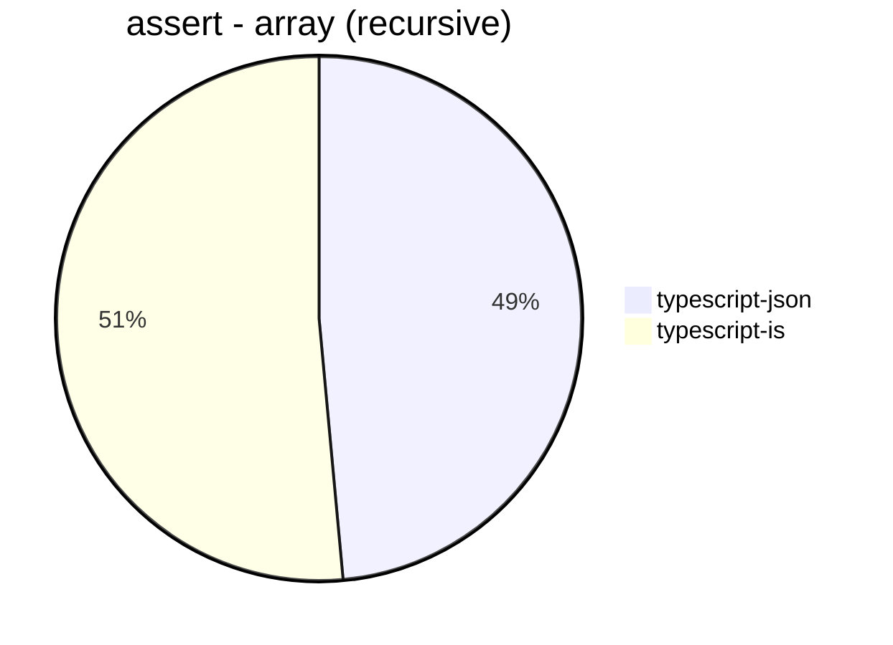
```mermaid
pie title assert - array (recursive)
  "typescript-json": 1334.4607290492295
  "typescript-is": 1414.7048170952553
```

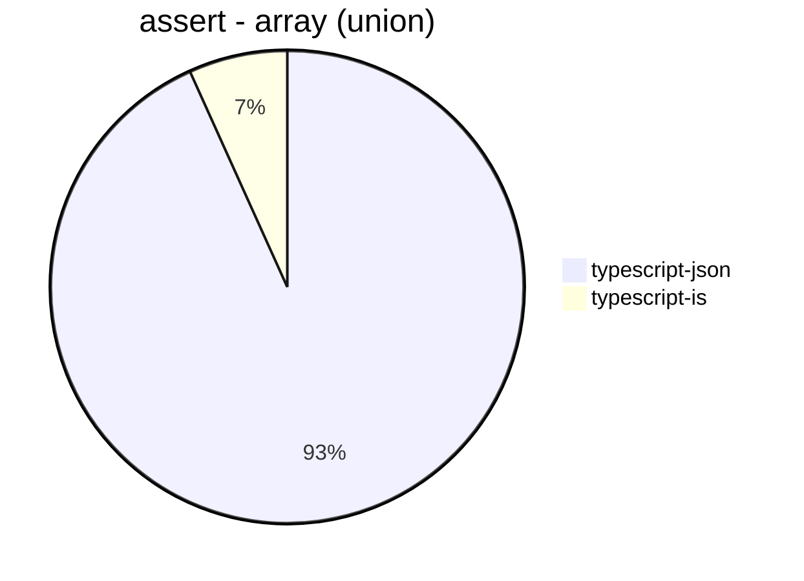
```mermaid
pie title assert - array (union)
  "typescript-json": 3045.815295815296
  "typescript-is": 220.28035681776805
```

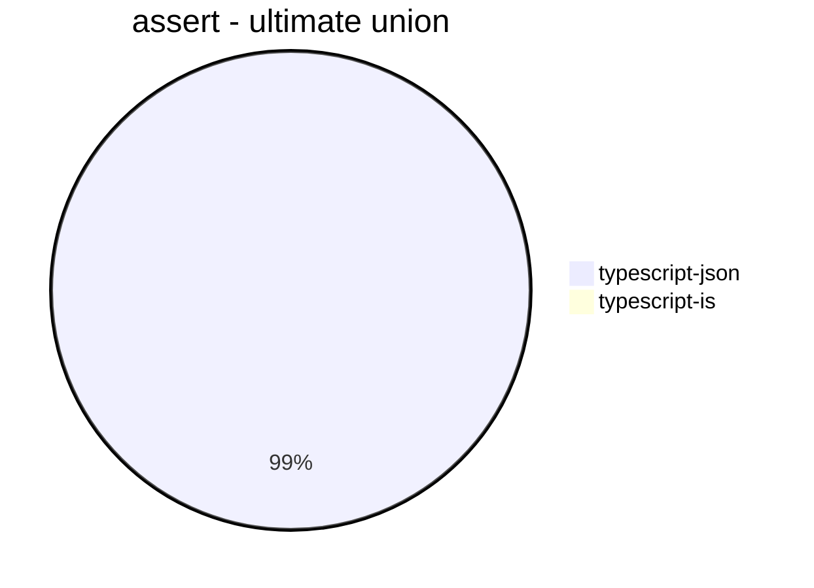
```mermaid
pie title assert - ultimate union
  "typescript-json": 4348.802673101913
  "typescript-is": 31.990102509720746
```

## is
 Components | typescript-json | typescript-is | ajv 
------------|-----------------|---------------|-----
object (hierarchical) | 94690.98331558394 | 44328.6419301773 | 60200.60953746863
object (recursive) | 50327.04063286587 | 38055.38178472861 | Failed
object (union, explicit) | 13950.084443610434 | Failed | 1316.3881976537505
object (union, implicit) | 12909.923928077456 | Failed | Failed
array (recursive) | 4230.60069381048 | 3178.3392160505296 | Failed
array (union, explicit) | 5822.516316171139 | 958.0357142857143 | Failed
array (union, implicit) | 5465.643274853801 | 1075.0660792951542 | Failed
ultimate union | 9179.453345900094 | 300.634026065516 | Failed

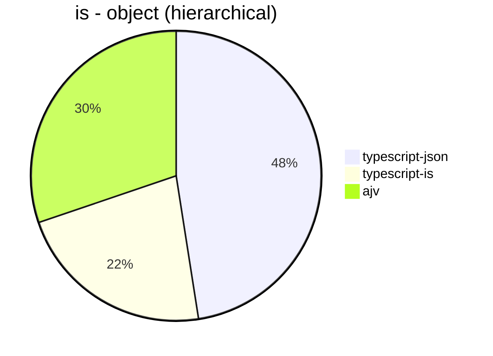
```mermaid
pie title is - object (hierarchical)
  "typescript-json": 94690.98331558394
  "typescript-is": 44328.6419301773
  "ajv": 60200.60953746863
```

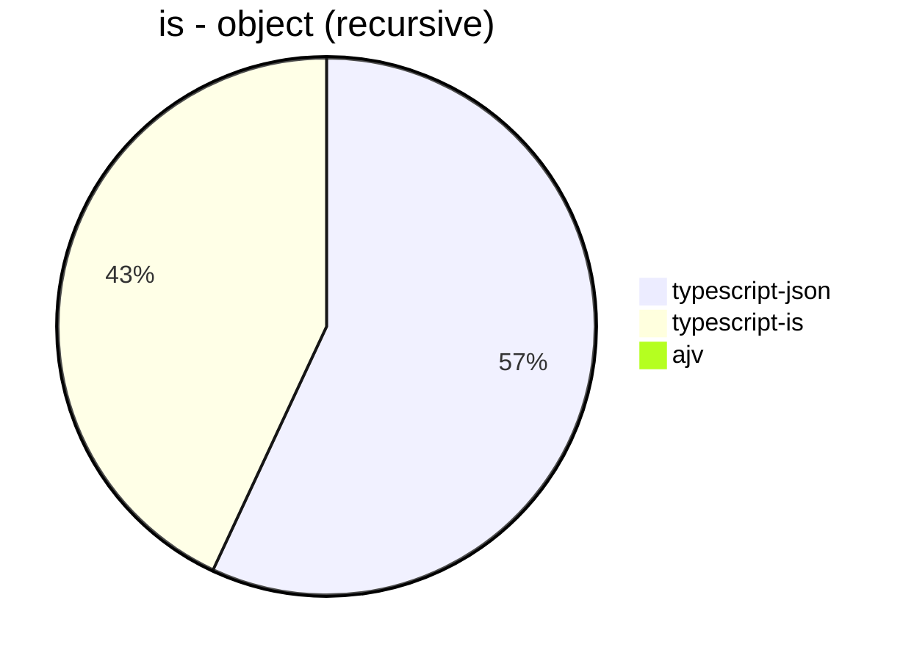
```mermaid
pie title is - object (recursive)
  "typescript-json": 50327.04063286587
  "typescript-is": 38055.38178472861
  "ajv": 0
```

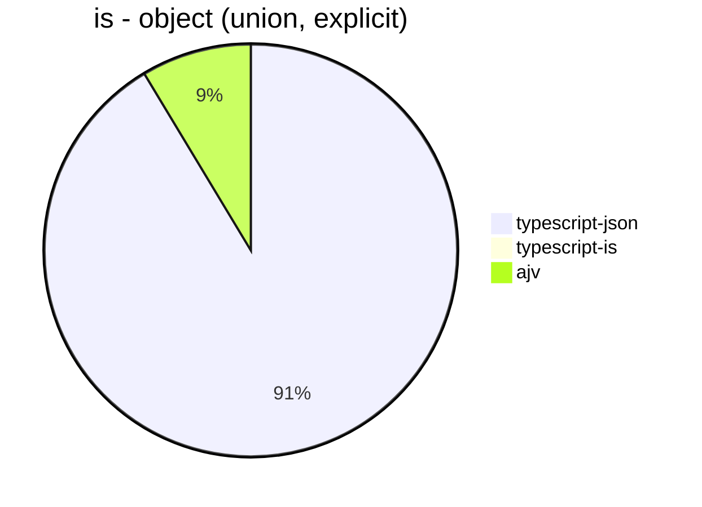
```mermaid
pie title is - object (union, explicit)
  "typescript-json": 13950.084443610434
  "typescript-is": 0
  "ajv": 1316.3881976537505
```

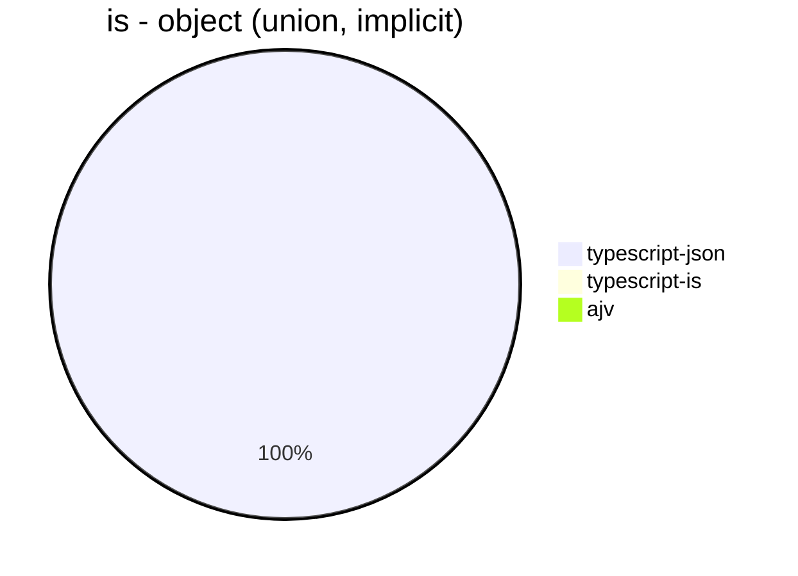
```mermaid
pie title is - object (union, implicit)
  "typescript-json": 12909.923928077456
  "typescript-is": 0
  "ajv": 0
```

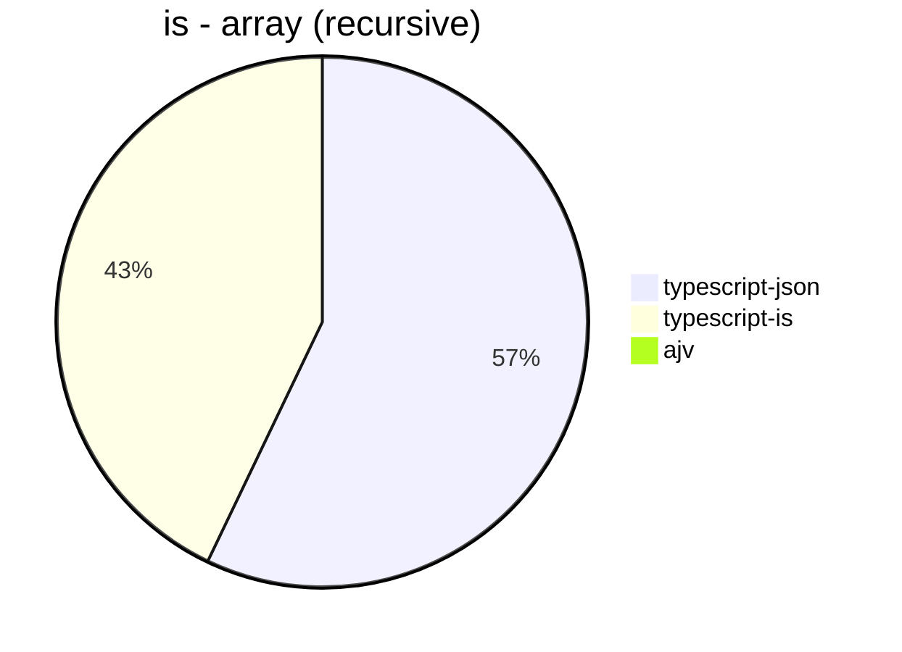
```mermaid
pie title is - array (recursive)
  "typescript-json": 4230.60069381048
  "typescript-is": 3178.3392160505296
  "ajv": 0
```

```mermaid
pie title is - array (union, explicit)
  "typescript-json": 5822.516316171139
  "typescript-is": 958.0357142857143
  "ajv": 0
```

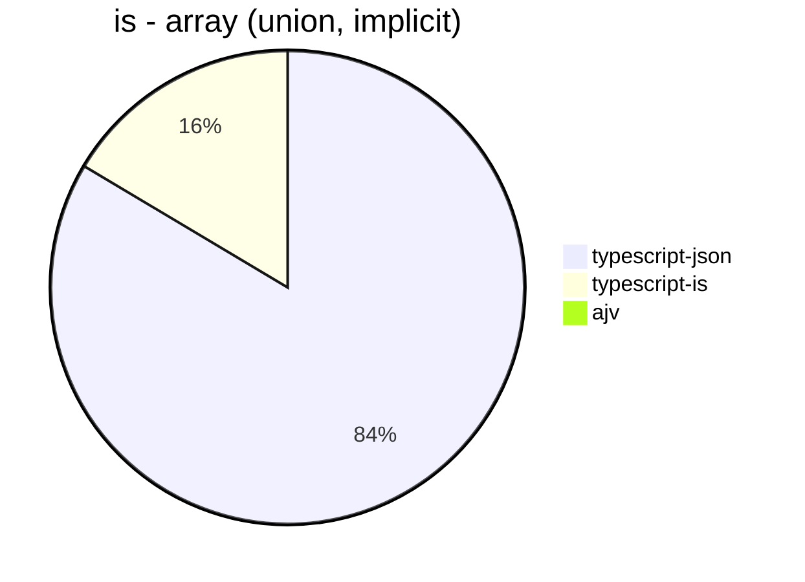
```mermaid
pie title is - array (union, implicit)
  "typescript-json": 5465.643274853801
  "typescript-is": 1075.0660792951542
  "ajv": 0
```

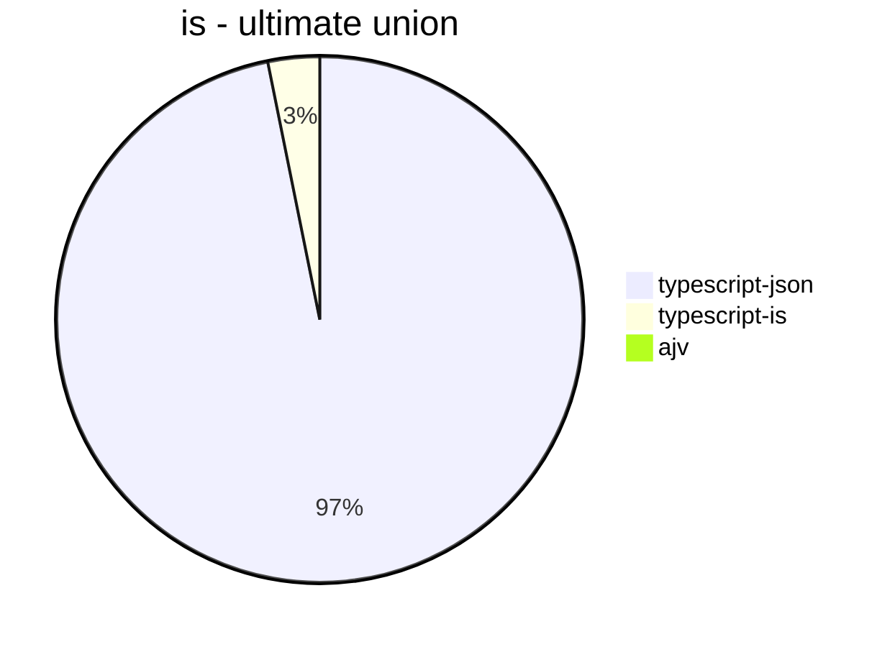
```mermaid
pie title is - ultimate union
  "typescript-json": 9179.453345900094
  "typescript-is": 300.634026065516
  "ajv": 0
```

## optimizer
 Components | typescript-json | fast-json-stringify | JSON.stringify() 
------------|-----------------|---------------------|------------------
object (simple) | 39662.93134115973 | 6.919801277501774 | 10384.333149880757
object (hierarchical) | 5369.304556354916 | 1.4169323414806942 | 2507.3937153419593
object (recursive) | 4906.858114490837 | 61.60164271047228 | 2071.2293100241773
object (union) | 2116.8736303871437 | 1.0853835021707672 | 1427.478134110787
array (hierarchical) | 70.43525374751671 | 2.3662176920276665 | 58.17378497790869
array (recursive) | 258.86847371293436 | 53.44482821305217 | 209.37961595273262
array (union) | 402.0731042007638 | 2.171945701357466 | 399.9635900236665
ultimate union | 1401.0549290651145 | Failed | 319.18352601156073

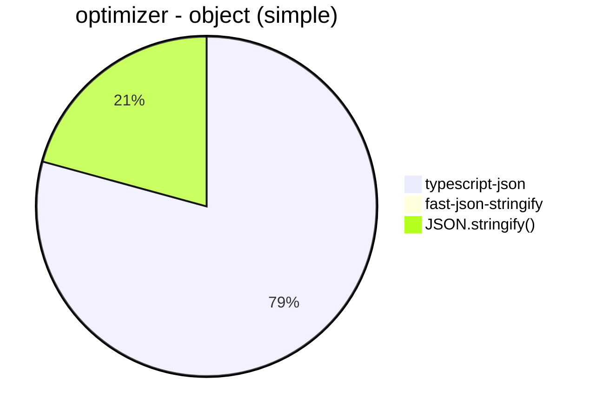
```mermaid
pie title optimizer - object (simple)
  "typescript-json": 39662.93134115973
  "fast-json-stringify": 6.919801277501774
  "JSON.stringify()": 10384.333149880757
```

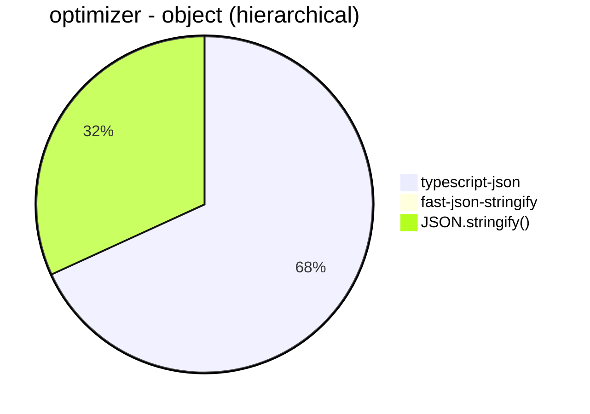
```mermaid
pie title optimizer - object (hierarchical)
  "typescript-json": 5369.304556354916
  "fast-json-stringify": 1.4169323414806942
  "JSON.stringify()": 2507.3937153419593
```

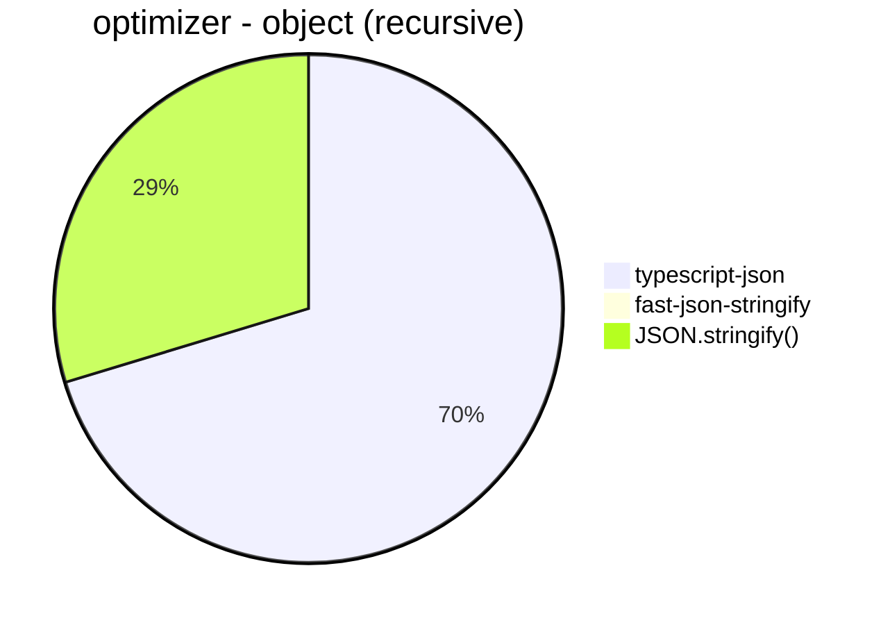
```mermaid
pie title optimizer - object (recursive)
  "typescript-json": 4906.858114490837
  "fast-json-stringify": 61.60164271047228
  "JSON.stringify()": 2071.2293100241773
```

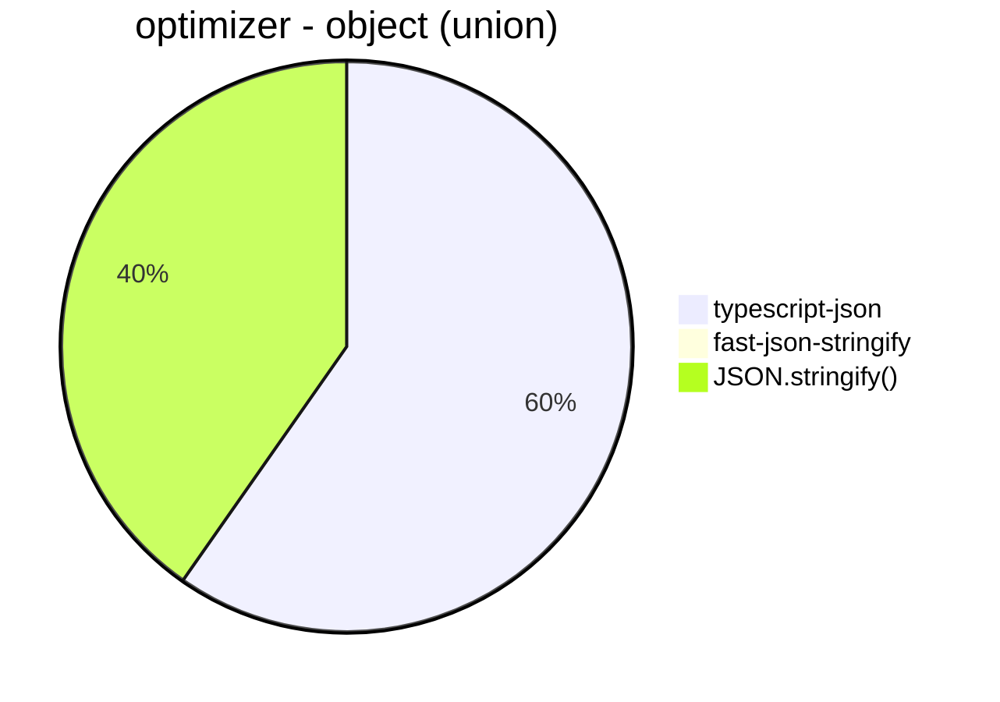
```mermaid
pie title optimizer - object (union)
  "typescript-json": 2116.8736303871437
  "fast-json-stringify": 1.0853835021707672
  "JSON.stringify()": 1427.478134110787
```

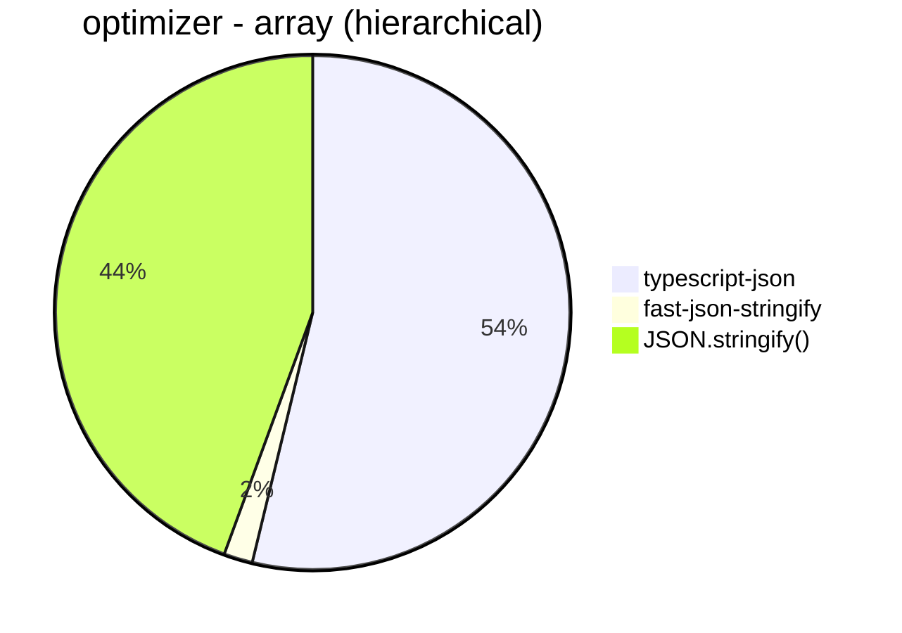
```mermaid
pie title optimizer - array (hierarchical)
  "typescript-json": 70.43525374751671
  "fast-json-stringify": 2.3662176920276665
  "JSON.stringify()": 58.17378497790869
```

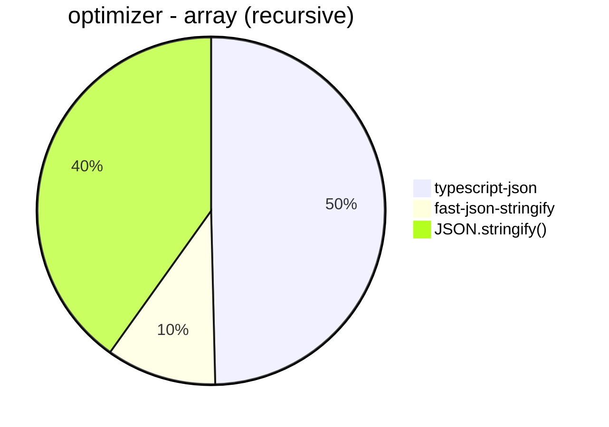
```mermaid
pie title optimizer - array (recursive)
  "typescript-json": 258.86847371293436
  "fast-json-stringify": 53.44482821305217
  "JSON.stringify()": 209.37961595273262
```

```mermaid
pie title optimizer - array (union)
  "typescript-json": 402.0731042007638
  "fast-json-stringify": 2.171945701357466
  "JSON.stringify()": 399.9635900236665
```

```mermaid
pie title optimizer - ultimate union
  "typescript-json": 1401.0549290651145
  "fast-json-stringify": 0
  "JSON.stringify()": 319.18352601156073
```

## stringify
 Components | typescript-json | fast-json-stringify | JSON.stringify() 
------------|-----------------|---------------------|------------------
object (simple) | 41461.920529801326 | 26130.919729383797 | 10031.590219525255
object (hierarchical) | 5974.612656337502 | 5092.341118957089 | 2494.0850277264326
object (recursive) | 5061.046511627907 | 2110.704483074108 | 2109.2143906020556
object (union) | 2111.4327062228654 | 1542.1014753508457 | 1422.415387460699
array (hierarchical) | 117.97957695113057 | 153.023598820059 | 89.58749772851172
array (recursive) | 259.46445060018465 | 209.49720670391062 | 203.10245310245313
array (union) | 392.1777777777778 | 350.04608294930875 | 395.12731269463274
ultimate union | 1349.4083901039799 | Failed | 324.54212454212455

```mermaid
pie title stringify - object (simple)
  "typescript-json": 41461.920529801326
  "fast-json-stringify": 26130.919729383797
  "JSON.stringify()": 10031.590219525255
```

```mermaid
pie title stringify - object (hierarchical)
  "typescript-json": 5974.612656337502
  "fast-json-stringify": 5092.341118957089
  "JSON.stringify()": 2494.0850277264326
```

```mermaid
pie title stringify - object (recursive)
  "typescript-json": 5061.046511627907
  "fast-json-stringify": 2110.704483074108
  "JSON.stringify()": 2109.2143906020556
```

```mermaid
pie title stringify - object (union)
  "typescript-json": 2111.4327062228654
  "fast-json-stringify": 1542.1014753508457
  "JSON.stringify()": 1422.415387460699
```

```mermaid
pie title stringify - array (hierarchical)
  "typescript-json": 117.97957695113057
  "fast-json-stringify": 153.023598820059
  "JSON.stringify()": 89.58749772851172
```

```mermaid
pie title stringify - array (recursive)
  "typescript-json": 259.46445060018465
  "fast-json-stringify": 209.49720670391062
  "JSON.stringify()": 203.10245310245313
```

```mermaid
pie title stringify - array (union)
  "typescript-json": 392.1777777777778
  "fast-json-stringify": 350.04608294930875
  "JSON.stringify()": 395.12731269463274
```

```mermaid
pie title stringify - ultimate union
  "typescript-json": 1349.4083901039799
  "fast-json-stringify": 0
  "JSON.stringify()": 324.54212454212455
```

